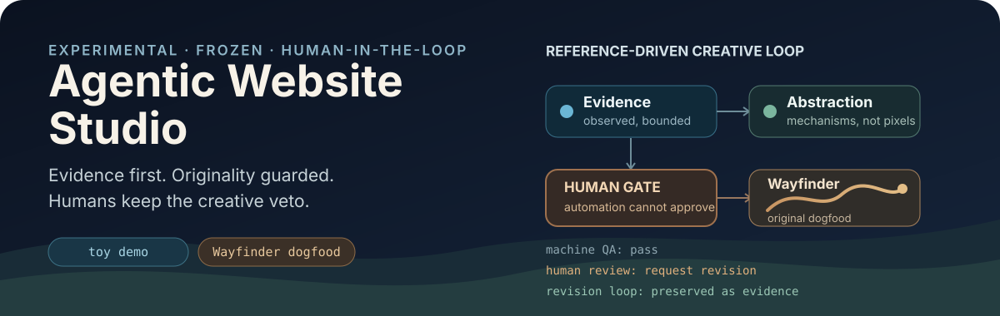

<p align="right">
  <strong>English</strong> · <a href="./README.zh-CN.md">简体中文</a>
</p>

<p align="center">
  
</p>

# Agentic Website Studio

**A frozen experimental toy demo for evidence-first, rights-aware, human-in-the-loop creative web workflows.**


> **Status:** frozen, experimental, no active roadmap. This repository is not production-ready and is not a website cloner.

Agentic Website Studio was a small R&D experiment around one question: **can an agent use public websites as references without collapsing research, interpretation, originality, and human judgment into one opaque “generate something similar” step?**

The repository keeps those stages explicit. It captures bounded evidence, separates observation from inference, abstracts reusable mechanisms, carries rights and anti-copy constraints forward, and stops automation at Human Gates before creative decisions are accepted.

## What it demonstrates

| Stage | Demonstrated behavior |
| --- | --- |
| **Reference research** | Passive, bounded browser evidence with conservative URL, privacy, and rights handling |
| **Design abstraction** | `observed_fact` stays separate from inference, evaluation, and transferable principles |
| **Multi-reference synthesis** | Abstract mechanisms can be combined without passing source URLs, assets, prose, or exact layouts into creative generation |
| **Human control** | Automation can prepare and validate a gate, but it cannot approve its own creative direction |
| **Implementation QA** | Local deterministic tests, Playwright browser QA, accessibility checks, provenance manifests, and replayable state |
| **Dogfood** | Wayfinder / Three Bearings exercises the workflow end to end as original project-native work |

The most useful result was not a perfect first attempt. **Machine QA passed while human evaluation still rejected the experience.** That rejection became structured feedback, drove a bounded revision, and remained visible as part of the project history rather than being rewritten as success.

## Workflow

```text
Public references
      ↓
Bounded evidence
      ↓
Reference profiles + design principles
      ↓
Multi-reference synthesis
      ↓
Originality firewall
      ↓
Original creative concepts
      ↓
HUMAN GATE
      ↓
Implementation contract
      ↓
Playable implementation
      ↓
Automated QA
      ↓
HUMAN EVALUATION
```

The detailed data model and trust boundaries are documented in [Architecture](docs/ARCHITECTURE.md) and [Policies](docs/POLICIES.md).

## Wayfinder dogfood

**Wayfinder / Three Bearings** is the included original dogfood example. It is a compact interactive journey created through the workflow above; it is **not** a released product.

The pilot is useful because it preserved real disagreement between machine and human evaluation:

```text
machine checks pass
      ↓
human: “this still feels like a web demo”
      ↓
feedback artifact + revision contract
      ↓
continuous-world revision
      ↓
human: “this now feels like a small interactive work”
```

The final repository keeps the experiment frozen rather than continuing to polish or generalize it indefinitely.

### Run the demo

Requires Node.js 24 or later.

```powershell
npm ci
$Env:PLAYWRIGHT_BROWSERS_PATH="0"
npx playwright install chromium
npm run wayfinder:preview
```

Open `http://127.0.0.1:4173` after the preview server starts. Stop it with `Ctrl+C`.

Run the full Wayfinder QA gate with:

```powershell
npm run wayfinder:qa
```

## Research CLI

The earlier evidence tooling remains available for local experimentation, but it is secondary to the frozen demo:

```powershell
npm run studio -- capture --url https://example.com --project example
npm run studio -- prepare-analysis --run runs/example/<run-id>
npm run studio -- validate-analysis --run runs/example/<run-id> --profile runs/example/<run-id>/reference-profile.json --principles runs/example/<run-id>/design-principles.json
```

Generated runs stay local and are ignored by Git.

## Design principles behind the demo

- **Evidence before inference.** Browser observations are not allowed to masquerade as design judgment.
- **Abstraction before reuse.** Public accessibility does not make source expression reusable.
- **Originality before implementation.** Creative agents work from source-neutral abstractions rather than source pages or assets.
- **Machine QA is not human approval.** Deterministic validation covers what can be tested; aesthetic and experiential claims remain human judgments.
- **Evidence before self-improvement.** Lessons from one pilot remain candidate rules until broader evidence justifies promotion.

## Documentation

| Document | Purpose |
| --- | --- |
| [Architecture](docs/ARCHITECTURE.md) · [简体中文](docs/ARCHITECTURE.zh-CN.md) | Evidence layers, provenance, firewalls, Human Gates, and implementation boundaries |
| [Policies](docs/POLICIES.md) · [简体中文](docs/POLICIES.zh-CN.md) | Public-reference, rights, privacy, originality, and artifact policies |
| [Reference Intelligence Protocol](docs/REFERENCE_INTELLIGENCE_PROTOCOL.md) | Evidence-only single-reference analysis protocol |
| [Creative Protocol](docs/M3_CREATIVE_PROTOCOL.md) | Multi-reference synthesis and creative-concept boundary |
| [Wayfinder Project Lessons](docs/WAYFINDER_PROJECT_LESSONS.md) | Evidence-bounded lessons and candidate reusable rules |
| [Third-party materials](THIRD_PARTY.md) | Dependency and reference-project attribution boundary |

Machine-readable schemas, manifests, Human Gate artifacts, QA reports, and historical pilot records are intentionally kept in their original form rather than duplicated as translated copies.

## Status and limitations

**Frozen toy demo. No active roadmap.**

- Wayfinder: completed internal dogfood pilot.
- Public source repository: available as-is.
- Hosted service: none.
- Deployment: none.
- Pilot 2: not started.
- Active maintenance commitment: none.

Limitations:

- not production hardened;
- agent isolation is procedural/contract-based rather than cryptographic;
- automated metadata is not legal advice or automatic rights clearance;
- browser and accessibility checks are bounded evidence, not universal guarantees;
- the project does not claim to outperform current native agent platforms.

## Rights and originality

**Public accessibility does not imply reuse permission.**

Reference screenshots and observed third-party material are treated as research evidence, not reusable assets. Derived principles preserve rights caveats and anti-copy constraints. The workflow is an engineering guardrail, not a legal determination that a resulting design is safe merely because it is “abstracted.”

## License

Project-authored source is available under the [MIT License](LICENSE). Dependencies retain their own licenses; public reference projects were studied as research/inspiration and are not vendored source or creative assets. See [THIRD_PARTY.md](THIRD_PARTY.md).

---

<sub>README presentation follows the project-native, proof-first principles documented by <a href="https://github.com/oil-oil/beautify-github-readme">beautify-github-readme</a>.</sub>
